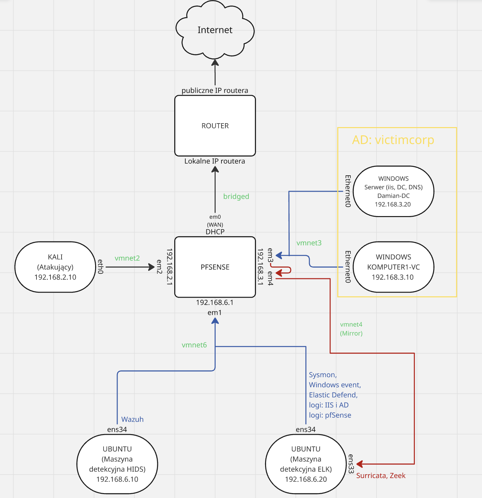

## Network Topology

Figure 2 presents a graphical representation of the laboratory environment, including the network segmentation, machine roles, and network interfaces used.

**Figure 2 — Laboratory environment topology**

**Configured subnets:**
- **192.168.2.0/24** – network for the attacking machine (**Kali Linux**), physically and logically isolated
- **192.168.3.0/24** – internal victim network simulating a **Windows** environment with **Active Directory**
- **192.168.6.0/24** – detection network used for log collection and passive monitoring

Traffic from the **192.168.3.0/24** network (interface `em3` on **pfSense**) is mirrored via  
**SPAN (port mirroring)** to interface `em4`.

This setup enables passive analysis of all network traffic using tools such as  
**Zeek** and **Suricata** in IDS mode (see Chapter 2.8).  
Such a configuration is typical for **Security Operations Center (SOC)** environments.
