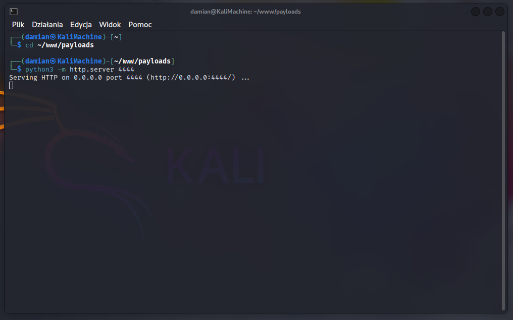

## 5.2 Generating the C2 Payload (Apollo) in Mythic

Using the **Mythic C2 console** from the **Kali Linux** machine, a **malicious executable file** (`update_service_Mal.exe`) was created using the **Apollo agent**.

The payload was configured as a **WinExe** file, set to **connect to the C2 server on port 80** with a **communication interval of 10 seconds**.

The file was then placed in the **HTTP server directory running locally on port 4444**  
(**Figure 3** — note: some figures in sections 5.2–5.6 show the same attack executed at a different time):

```bash
cd ~/www/payloads
python3 -m http.server 4444
```



**Figure 3 — HTTP server running on port 4444 with the generated Apollo payload**
