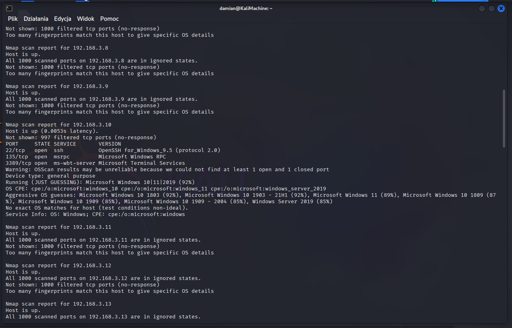

## 5.3 Network and Port Scanning with Nmap

To identify **available hosts, network services, and operating systems** in the test environment, an **active network scan** was performed using **Nmap**.  
This helped determine which machines could be **potential attack targets** and what **services are exposed**.

From the **Kali Linux** machine, the `192.168.3.0/24` network was scanned to detect available hosts and open services:

```bash
nmap -Pn -sS -sV -O -T4 192.168.3.1-30
```

The scan results showed that:

- **192.168.3.20** is a **Windows Server 2019** machine  
- **192.168.3.10** is a **Windows 10** machine  
- **Port 3389 (RDP)** was detected as **open** on `192.168.3.10`



**Figure 4 — Nmap scan results showing the open RDP port on 192.168.3.10**
