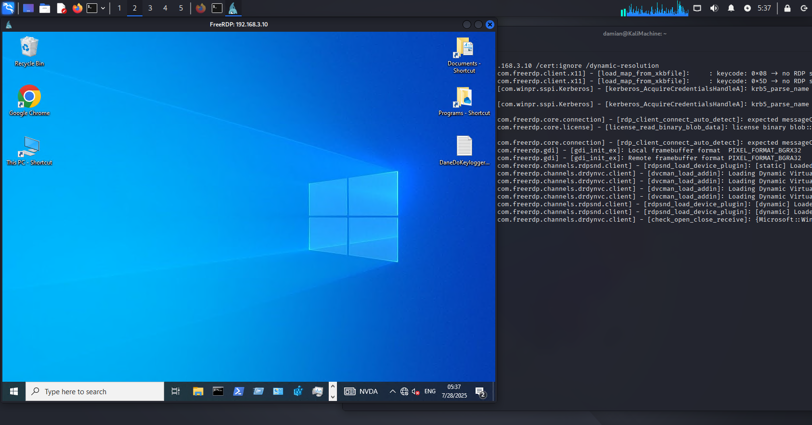

## 5.5 Preparing the System to Download the Payload

After obtaining the credentials (**login: adm, password: security**), an **RDP session** was initiated from the **Kali Linux** machine to the victim machine (`192.168.3.10`)  
(**Figure 6**):

```bash
xfreerdp3 /u:adm /p:security /v:192.168.3.10 /cert:ignore /dynamic-resolution
```



**Figure 6 — Remote RDP session on the victim machine**

Within the newly opened graphical session, an **initial reconnaissance** was performed using **PowerShell** (`whoami`, `ipconfig`, `systeminfo`).  
Afterwards, the system was prepared to receive the **C2 payload**.

To achieve this, a **Windows Defender exclusion** was added for the destination folder where the `.exe` file would be stored.  
However, adding such an exclusion requires **disabling Tamper Protection** in **Windows Security settings**, which was done manually via the graphical interface.

Then, a PowerShell command was executed to add the exclusion:

```powershell
Add-MpPreference -ExclusionPath "C:\Users\Public\Downloads"
```

After adding the exclusion, **Tamper Protection was re-enabled**.

This sequence — temporarily disabling protection, adding an exclusion, and re-enabling protection — ensures that from the perspective of a **Windows user or administrator**, all protections appear to be active.  
In the **Windows Security** interface, all mechanisms seem enabled, while the previously added exclusion **remains active**, allowing the attacker to **hide the malicious file from Defender scans**.

This is a **common technique used to bypass system protection without raising suspicion**, especially effective in environments where monitoring is limited to checking the **general protection status**.
