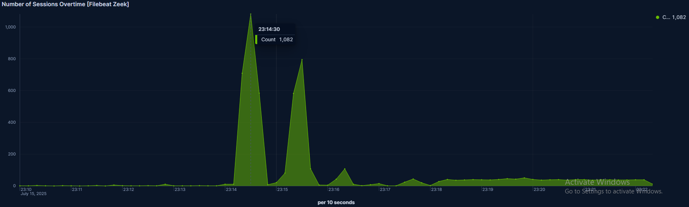
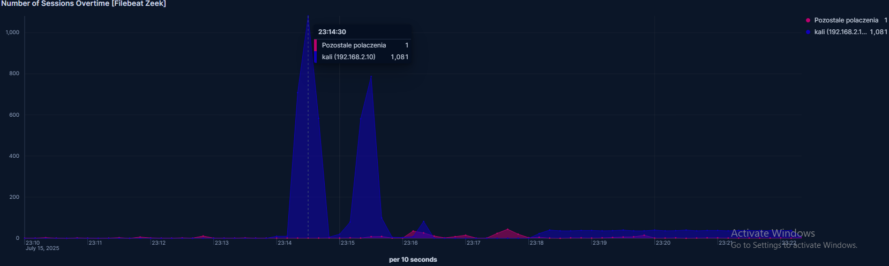
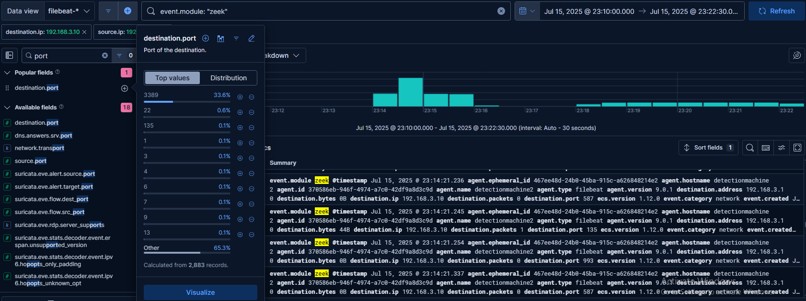
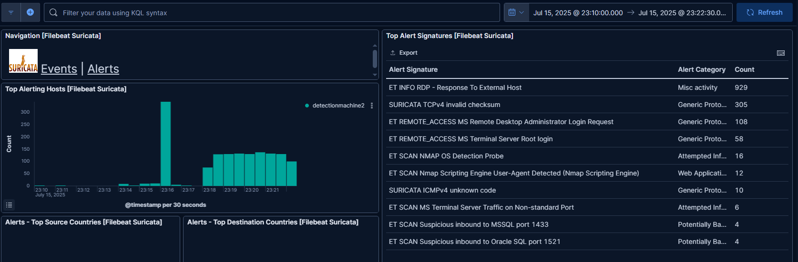

## 6.1. Detection of the Attack at the Network Level

As the first step of the detection analysis, logs generated by the **Zeek** system were examined.  
With **Zeek**, it was possible to detect characteristic patterns of **port scanning (Nmap)** and **brute-force attacks (Hydra)**.

Due to visible high connection activity within the network during a short time window, a detailed analysis was performed for **July 15, 23:10:00–23:22:30**, during which both stages of the attack occurred — first **network scanning using Nmap**, then a **brute-force attempt to break RDP authentication using Hydra**.  
Log entries related to communication with the detection machine were filtered out from the results.

In the **Zeek data visualization panel**, significant **anomalies in TCP session volume** were observed.  
The **23:10:00–23:14:00** period was used as a **baseline reference for normal traffic**.  
Between **23:14:00–23:16:40**, corresponding to the Nmap activity, the number of detected connections **sharply increased** (Figure 13).  

Before the attack, the average session rate was about **1–3 connections per 10 seconds**, while during the peak of the attack, it reached **1082 and 795 connections** in similar time windows.  
This is a clear indicator of **massive port scanning and numerous TCP session initiation attempts** in a short time.  
Because the whole subnet was scanned, logs also included traffic to the host at **192.168.3.20**.



**Figure 13 — Total number of TCP sessions over time (without host separation)**

In the next stage (**23:18:00–23:22:30**), Zeek showed **another increase in network activity**, this time **more regular and slightly lower**, about **200 connections per 10 seconds**.  
This aligns with the **brute-force RDP attack using Hydra** on the **192.168.3.10** machine, which involved numerous RDP session attempts in short intervals.

To deepen the analysis, a **custom panel** was created based on the previous chart, which allowed separating the traffic generated by the **attacking machine (Kali, IP 192.168.2.10)** from other traffic (Figure 14).  
This approach made it possible to **clearly link the abnormal traffic to a specific source**.  
After isolating this IP address, the **anomalies became even more visible**, confirming the involvement of this machine in the network attacks.



**Figure 14 — Number of TCP sessions over time, split between Kali (192.168.2.10) and other traffic**

For further analysis, the focus was narrowed **only to activity against the 192.168.3.10 workstation**, which was the **direct attack target**.  
A filter was applied in the **Discover mode in Kibana**, limiting the results to entries matching:

```kql
event.module: "zeek" AND destination.ip: "192.168.3.10" AND source.ip: "192.168.2.10"
```

The analysis revealed that a **significant portion of the connections targeted port 3389/TCP** (Figure 15), which **clearly indicates a brute-force attempt on the RDP service**.  
Although **port 3389 accounted for 33.6% of all connections from the attacking machine**, the remaining **65%+ were spread across many other ports**, most of them appearing only in **trace amounts (<0.1% each)** — also shown in Figure 15.  

Such a distribution is **typical of port scanning**, further confirming that **before the brute-force login attempts, reconnaissance was performed with Nmap**, scanning many services on the victim host.



**Figure 15 — Distribution of network connections by destination port – confirmation of Nmap port scanning**

Based on the **number of TCP sessions to port 3389 from the attacking machine**, the **characteristic port distribution**, and the **ShR pattern** in the connection history, it can be concluded that **after the Nmap scanning phase, an RDP brute-force attack with Hydra** was launched (Figure 16).  

**ShR** denotes **TCP sessions that were accepted but quickly reset by the target host**, which typically indicates **failed login attempts**, characteristic of **dictionary-based attacks**.


**Figure 16 — Zeek entries showing the `ShR` (SYN, reply, RST) pattern confirming repeated connection attempts**

To complement the detection, **alerts generated by Suricata** were also analyzed.  
Within the **23:10:00–23:22:30** time window, **Suricata recorded multiple events confirming the earlier findings** from the Zeek analysis.  

Figure 17 shows a **Suricata dashboard view** with alerts generated during the analyzed time frame.  
These alerts included **network reconnaissance attempts (Nmap)**, **detections related to the RDP service**, and **suspicious privileged account login attempts**.  
Their occurrence matches the **attack stages and the events captured by Zeek**.  

All these alerts were generated by **signature-based detection**, which works by **comparing network traffic against predefined rule patterns**.



**Figure 17 — Suricata alerts detected in the analyzed time window – port scan and brute-force attack**


