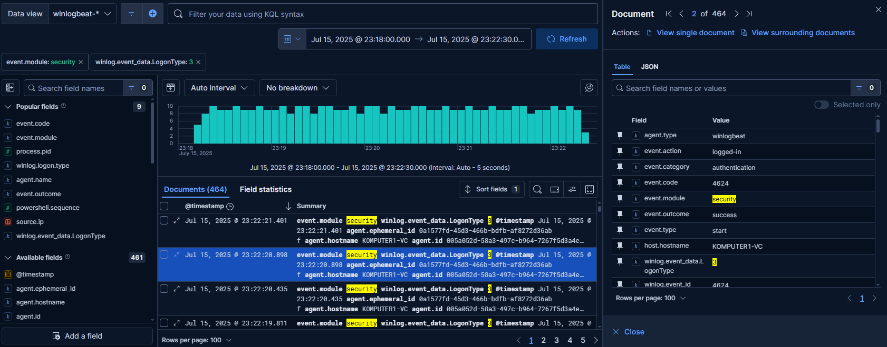
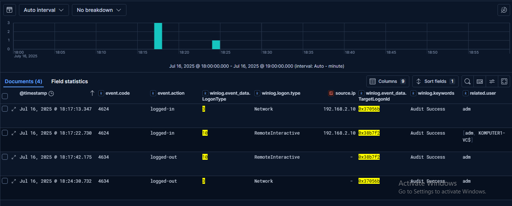

## 6.2. Verification of System Logs in the Context of the Attack

To complement the network analysis, **system logs collected by Sysmon (Event ID 3)** were examined.  
**Sysmon Event ID 3** records **all established network connections**.  

In the logs of the target machine (**192.168.3.10**), **two TCP connections** initiated from the **attacker's IP (192.168.2.10)** were observed — to **ports 3389/TCP (RDP)** and **22/TCP (SSH)**.  
These are **artifacts consistent with the reconnaissance phase performed by Nmap**, which attempted to identify available network services.  

During the part of the attack corresponding to the **Hydra brute-force phase**, the **Sysmon logs showed a large number of incoming connections from the same IP to port 3389/TCP**, confirming **intense network activity associated with the brute-force attack on the RDP service**.

Additionally, the **Windows Security Event Log** was analyzed for the **23:18:00–23:22:30** time range.  
During this period, **numerous Event ID 4625 entries** were recorded (Figure 18), indicating **failed login attempts**.  
Each of these events had **LogonType = 3**, which represents **network logons typical for brute-force attacks** carried out over the network.  

This type of attempt does **not initiate a full remote desktop session**, which explains the absence of **LogonType = 10**.  
Only at **23:22:20** did the first **Event ID 4624** appear (Figure 18), meaning **successful user authentication**.  
Notably, this event also had **LogonType = 3**, meaning the **attacker guessed valid credentials but had not yet started a full remote session** at that point.

**Figure 18 — Windows Security logs showing successful LogonType 3 (network logon)**

The account used to log in had **administrator privileges**.  
Therefore, the system generated an additional **Event ID 4672**, indicating **special privileges assigned to the logon session**.  
Immediately after the successful login, **both session IDs were closed (Event ID 4634)**, suggesting that **Hydra did not continue interacting with the system after finding the correct password**, which aligns with its typical behavior of stopping after discovering valid credentials.

To confirm that a **remote login through the RDP protocol actually occurred**, the Windows Security logs were **filtered by the source IP 192.168.2.10 (attacker's Kali machine)** and **by the LogonType field**.  
The analysis revealed **two key LogonType values**:

- **LogonType = 3 (Network)** appeared on **July 16 at 18:17:13** for the user **adm**
- Immediately after, at **18:17:22**, a **LogonType = 10 (RemoteInteractive)** was recorded — which **clearly indicates an initiated remote RDP session**

To determine how long the remote session lasted, the **TargetLogonId field** was analyzed, which **identifies the session and links the login event to its termination**.  

For RDP logons, Windows generates **two linked events**:

- **LogonType = 10** — appears **immediately after successful authentication**
- **LogonType = 3 (Network)** — represents the **actual maintained network session**

Although it might initially seem that the RDP session **ended immediately after login**, in reality it was **still active via the Network session (LogonType = 3)** (Figure 19).

**Figure 19 — Windows Security logs showing RDP remote login from 192.168.2.10**

In this case, the **LogonType = 3 session from 192.168.2.10** ended only at **18:24:30**, which allowed **precisely determining the attacker's active time window: July 16, 18:17:13–18:24:30**.  
The detection analysis was then **narrowed to logs within this session window**, isolating only the events that occurred during the **attacker's active RDP session**.  

This approach allowed **extracting 248 logs** covering the **full context of actions performed during this session**.  
Such narrowing is especially important when attempting to **reconstruct the attack path** and **identify executed commands and processes**.
