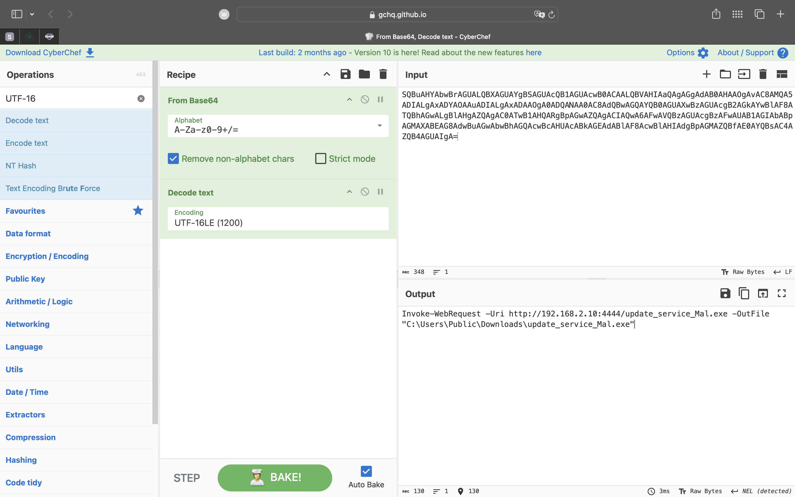
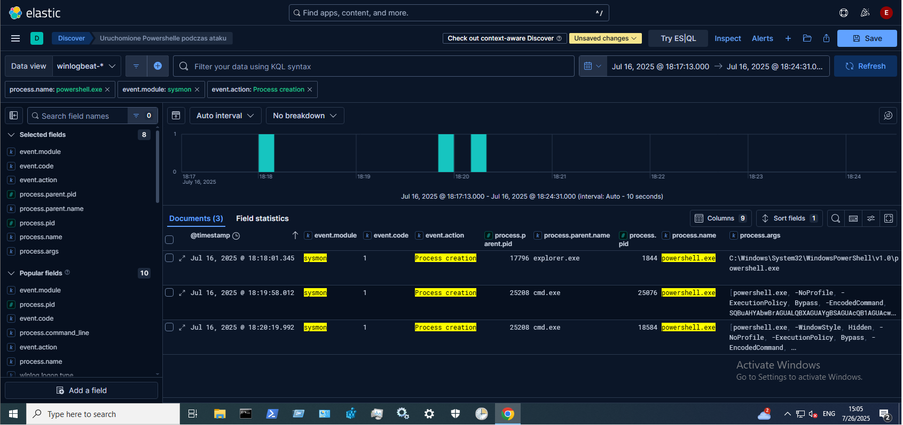
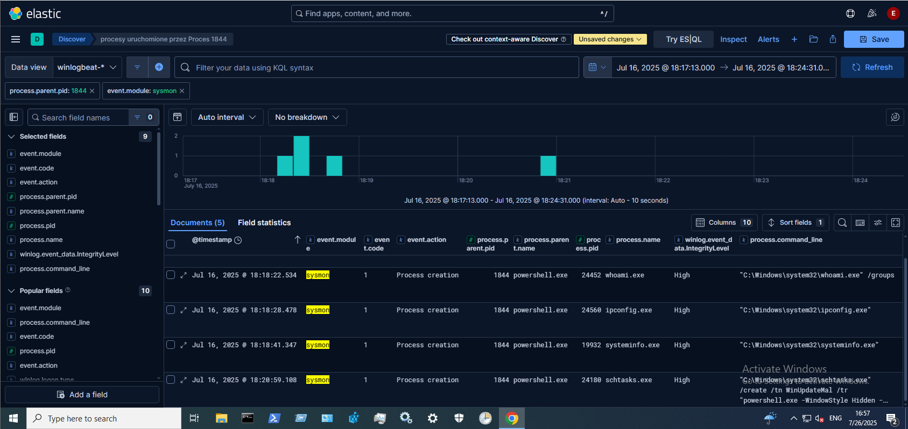
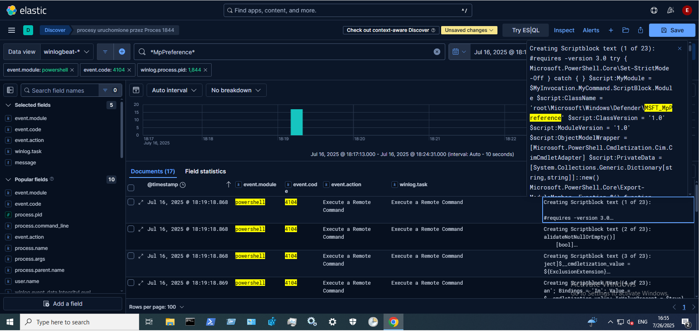

## 6.3. Analysis of PowerShell Activity and Child Processes

The initial log search for **known keywords or file paths** such as `Invoke-WebRequest` or `Start-Process` did **not show any obvious signs of downloading or executing malware**, because the **PowerShell commands used by the attacker were Base64-encoded**.  
This technique does not fully hide activity but can **hinder detection**.  

However, it is possible to find suspicious entries containing the **`-EncodedCommand`** flag, which clearly indicates an attempt to run an encoded command — a common technique used to **obfuscate the real purpose of the script**.  
In this analysis, a different detection method was used.

To identify possible use of PowerShell, the following filter was applied:

```kql
event.module: "sysmon" AND process.name: "powershell.exe" AND event.action: "Process creation"
```

This analysis was **restricted to the attacker's RDP session time window** identified earlier.  
This revealed **three unique PowerShell processes with different PIDs: 25076, 18584, and 1844**, as shown in Figure 21.  

These logs had **event.code = 1**, which in **Sysmon** means **process creation**.  
Two of these processes (**PID: 25076 and 18584**) contained **Base64-encoded arguments** in the `process.args` field, visible in Figure 21.  
These were **PowerShell commands using the `-EncodedCommand` flag**, responsible for **downloading and executing a file named `update_service_Mal.exe`**.

Using the `process.parent.pid` field, it was determined that **both processes were spawned by `cmd.exe`**, indicating **automatic execution from the command line**.  
After decoding the commands with **CyberChef**, it was confirmed that the file came from **192.168.2.10 (Kali)**, downloaded from **port 4444**, and saved as C:\Users\Public\Downloads\update_service_Mal.exe




**Figure 20 — Decoded PowerShell command in CyberChef – file download from the C2 server**

The third process (**PID: 1844**) was launched **without any arguments**, as shown in Figure 21.  
This means it **did not contain command details in the log**.  
Its parent process was **`explorer.exe`**, suggesting it was **manually launched from the graphical interface (GUI)**, e.g. by clicking a shortcut or searching in the Start menu.



**Figure 21 — Detected PowerShell processes within the analyzed time window**

To determine what actions were executed through this **PowerShell process (PID 1844)**, further analysis was done in **Kibana Discover**, filtering by process.parent.pid: "1844". 
This revealed **all processes spawned directly by this specific PowerShell instance** (Figure 22).  
The attacker performed a **full system reconnaissance** and **persistence setup** using built-in system tools:

- **whoami.exe /groups** – checked user context and group memberships  
- **ipconfig.exe** – obtained network configuration  
- **systeminfo.exe** – gathered system details  
- **schtasks.exe** – created a scheduled task to **automatically run the malicious file with SYSTEM privileges**

All of these were executed from **PowerShell PID 1844**, within the same **attacker session**.  
The **`process.command_line` field** in **Sysmon logs** showed the **full command line**, which allowed reconstructing the **exact `schtasks.exe` command** used to schedule the task (Figure 22).  

This included the **`/ru SYSTEM` parameter**, which causes the scheduled task to run under the **LocalSystem account**, giving it **higher privileges than an administrator account**.  
This means that even though the initial login was with the **`adm` account (administrator privileges)**, the scheduled task would **run with SYSTEM privileges**, achieving **privilege escalation** and **persistence**.



**Figure 22 — Processes spawned by PowerShell (PID 1844) – reconnaissance and persistence**

Notably, **no child processes indicated adding a Windows Defender exclusion**.  
This might be because **adding exclusions does not necessarily spawn a new process** and can happen **within the running PowerShell instance**.  

To verify this, **PowerShell Script Block Logging (event.code = 4104)** was searched for entries from **PID 1844** using a **wildcard filter: MpPreference**

This search found **multiple entries referencing `MSFT_MpPreference`** (Figure 23), confirming the **execution of scripts that modified Windows Defender configuration**, likely including **adding an exclusion for the `C:\Users\Public\Downloads` directory** where the malicious file was stored.  
This explains how the file could be **downloaded and executed without being blocked** by system protection.



**Figure 23 — PowerShell script block from PID 1844 referencing MpPreference**

In this analysis, **process identifiers (PIDs)** were used for clarity and readability.  
While this is sufficient in a **controlled lab environment**, it may **cause inaccuracies in large infrastructures** because **PIDs can be reused (PID recycling)** after processes terminate.  

This could lead to **misinterpreting logs or correlating unrelated events** when analyzing historical data.  
Therefore, in production environments, it is recommended to use the **ProcessGUID field**, which is **unique for each process and never reused**, ensuring accurate event correlation.


