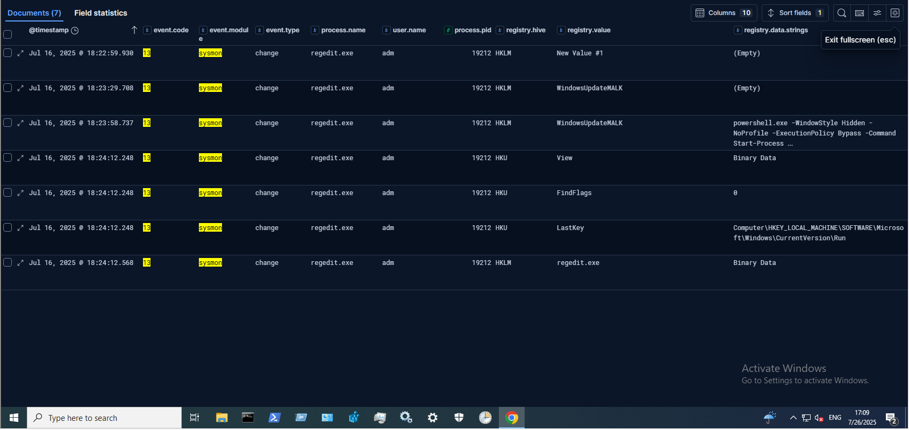

## 6.4. Persistence and Analysis of Persistent Mechanisms

To verify whether the attacker performed **additional actions from the Windows GUI during the RDP session**, processes **spawned by `explorer.exe`** (the default Windows shell process) were analyzed.  
This approach helps detect **applications launched directly by the user**, such as clicking shortcuts or typing names in the Start menu.

This analysis revealed several important processes: **powershell.exe**, **cmd.exe**, and **regedit.exe** (Figure 24).  
While the first two had already been linked to malicious activity, the launch of **regedit.exe** drew particular attention, as it may indicate an attempt to establish **persistence via registry modification**.

**Figure 24 — Processes launched from GUI by explorer.exe**

It is worth noting that **no process corresponding to the Windows Security application was recorded**, even though it had been **manually opened during the attack to disable Tamper Protection**.  
This may be because **explorer.exe is a user process in an interactive GUI session**, whereas **Windows Security is likely launched by a system process or an existing service thread**, which may not create a new `explorer.exe` child process.

To confirm the use of **regedit.exe for registry modification**, **Sysmon logs with event.code = 13** (registry value creation/modification) were analyzed for the **REGEDIT.EXE process with PID 19212** (Figure 25).  
The results clearly showed edits to keys under:
HKLM\Software\Microsoft\Windows\CurrentVersion\Run

This included **adding a value named `WindowsUpdateMALK`**, which contained a **PowerShell command launching `update_service_Mal.exe`** in a **hidden window and without user interaction**.  
This served as a **second persistence mechanism** (in addition to the scheduled task) and ran in the **context of a regular user**.

**Figure 25 — Registry modifications by regedit.exe (PID 19212) – agent persistence**

This analysis made it possible to **reconstruct the attacker’s full activity during the RDP session** — from system entry, through reconnaissance and system modification, to deploying **persistent mechanisms**.

Based on **logon event analysis**, it was possible to **identify user sessions during which the `update_service_Mal.exe` file was running**:

- **adm user: 18:24–18:30**
- **Damian user: 18:33–18:43**

For the **adm user**, the **physical local login interrupted the previously active RDP session** used by the attacker.  
This means that the **Apollo agent, previously launched manually by the attacker, was still running in the background**, but **persistence mechanisms had not yet been triggered** because the session switch prevented autorun.

This changed during the **subsequent login by the Damian user at 18:33**, which **started a new session**.  
This allowed the system to **execute both persistence mechanisms**:

- the **scheduled task (running with SYSTEM privileges)**  
- and the **registry key in `HKLM\Software\Microsoft\Windows\CurrentVersion\Run`** launching the Apollo agent in the **context of the logged-in user**

As a result, during the **Damian session (lasting until 18:43)**, the **malware was launched again automatically**.  
Therefore, the next step of the analysis was to **observe the Apollo agent’s activity in the new user and system context**.

