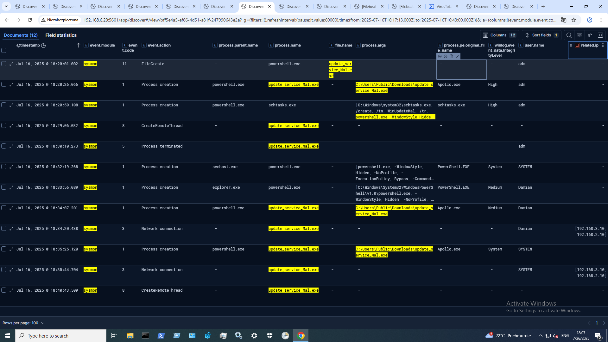
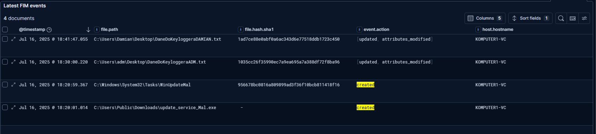
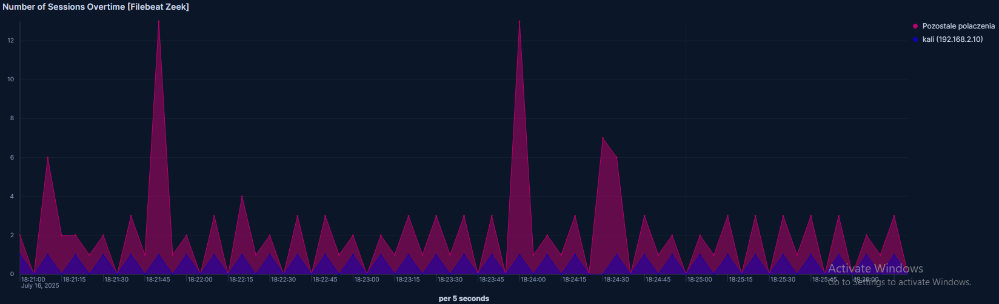
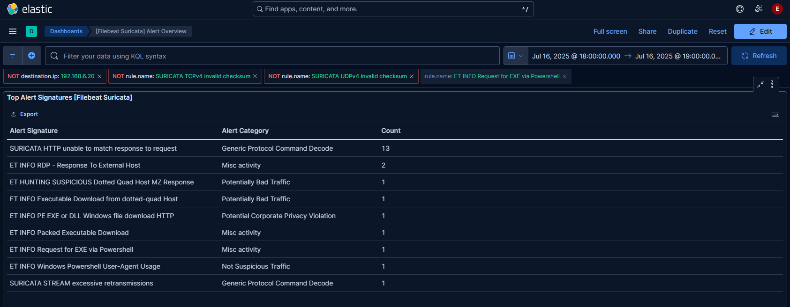

## 6.5. Tracking the Malicious File and Subsequent Activity of the Apollo Agent

In the next stage of the analysis, the focus was on **examining the activity of the `update_service_Mal.exe` file**, which was responsible for launching the **Apollo agent**.  
The investigation started by searching the entire attack time range (**18:17:13–18:43:00**) for logs containing the filename using a **wildcard query**:

```kql
update_service_Mal.exe AND event.module: "sysmon"
```

Initially, **17 logs** were found, but after **filtering out `event.code = 13` logs (registry modifications already analyzed earlier)**, the results were narrowed down to **12 key entries**.  
The view in the interface was then adjusted to include only the **most relevant fields**, which allowed creating a **clear and logical table showing the file’s activity throughout its lifecycle** (Figure 26).

The logs included, among others:

- **event.code = 11** – file written to disk (with its location)  
- **event.code = 1** – process creations from `update_service_Mal.exe` (both by `adm` and `Damian` accounts)  
- **Privilege levels** the process ran with (High, System, Medium)  
- **Full file paths** from which the program was launched (`C:\Users\Public\Downloads\`)  
- **event.code = 3** – attempts to establish network connections (e.g. to `192.168.3.10` and `192.168.2.10`)  
- **event.code = 5** – termination of the process (coinciding with user logoff)  
- **event.code = 8** – process injection, confirming two **injection attacks by the Apollo agent** (first from `adm`, later from `Damian`)  
  - Using the **TargetProcessId** and **TargetImage** fields, it was determined that the injection targeted **processes spawned by `notepad.exe`**



**Figure 26 — Sysmon logs showing the activity of update_service_Mal.exe**

The table made it possible to **link all stages of the malware’s activity** — from creation, through launches by different users and privilege levels, to **network connections and injection attempts**.  
This shows how much valuable information **Sysmon logs can provide when filtered and visualized correctly**.

The **Sysmon `OriginalFileName` field** revealed that although the file was saved as `update_service_Mal.exe`, it was originally named **`Apollo.exe`**.  
Such metadata can be crucial when **malware tries to masquerade as legitimate system components**.

The logs also contained the **cryptographic hash** of `update_service_Mal.exe`, which serves as a **unique identifier** of the artifact.  
This hash can be compared against external malware databases such as **VirusTotal**, even if the original file is no longer available.  
If the file has been deleted or cannot be shared for legal reasons, **analyzing its hash remains the only reliable way to verify it**.

One possible next step would be to **track malicious processes by their PIDs (24772, 20312, 18280)** obtained from **Sysmon event ID 1**, to monitor **all processes spawned by the Apollo agent**.  
However, this approach faces serious limitations.

During this analysis, it was observed that **many actions performed by the attacker through Apollo were not detected in Sysmon logs**, such as:

- System reconnaissance (`whoami`)  
- Taking screenshots  
- Data exfiltration to the C2 server (`download`)

This is because the **Apollo agent is designed to hide its presence**, operating **almost entirely in RAM** and **not creating visible child processes** detectable by Sysmon.  
It often does **not spawn visible PowerShell or CMD interpreters**, so **no explicit commands appear in the logs** even though they were executed.  

As a result, **Apollo’s activity remains nearly invisible to traditional process-based log analysis**.  
This highlights the difference between:

- **Gaining access and manually performing actions** (which leave many traces: processes, commands, log entries)  
- versus **using advanced fileless C2 frameworks like Apollo**, which are **far more stealthy**

This does **not mean Apollo is completely undetectable**, but it requires a **different, more advanced detection approach**.

---

Switching to the **FIM (File Integrity Monitoring) dashboards** made it possible to **quickly verify file system, task scheduler, and registry changes**.  
The FIM dashboard monitors **file modifications (create, edit, delete) in specific locations or system components**.  
In this case, several key events were immediately visible:

- Creation of `update_service_Mal.exe` in  
  `C:\Users\Public\Downloads\`  
- Adding its execution to the **task scheduler** (a persistence technique)  
- Modifications to text files used as **test keylogger targets**:  
  `DaneDoKeyloggeraADM.txt` and `DaneDoKeyloggeraDAMIAN.txt`



**Figure 27 — Example changes detected by the FIM mechanism**

---

Then, the **Zeek dashboards** were used, narrowing the time window to the attack.  
Zooming in on the **sessions-over-time graph** revealed a **highly repetitive and rhythmic pattern from `192.168.2.10`**, which is **characteristic of C2 beaconing** (Figure 28).  
Such patterns can help SOC analysts **detect malware using regular beaconing**.



**Figure 28 — Zeek dashboard showing regular beaconing during the attack**

---

At the same time, analyzing **alerts generated by Suricata** provided further confirmation of the attacker’s activity (Figure 29).  
Some of the most significant alerts included:

- **ET INFO RDP – Response To External Host** — detection of a remote RDP connection  
- **ET INFO Request for EXE via PowerShell** — indicating an attempt to download an executable via PowerShell  
- **ET INFO PE EXE or DLL Windows file download HTTP** — detection of an `.exe` file in an HTTP response  

Some logs even showed the **exact port and IP address from which the suspicious executable was downloaded**.



**Figure 29 — Suricata alerts generated during the attack**

---

While at this point the information from **Zeek**, **Suricata**, and **FIM** was no longer critical (as the attack path was already fully reconstructed),  
these findings **would have been very valuable in the early stages of the investigation**, especially if the analysis **had not yet focused on any specific suspicious file**.


