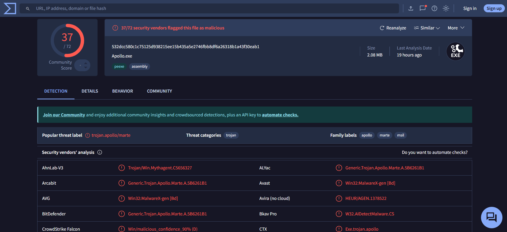
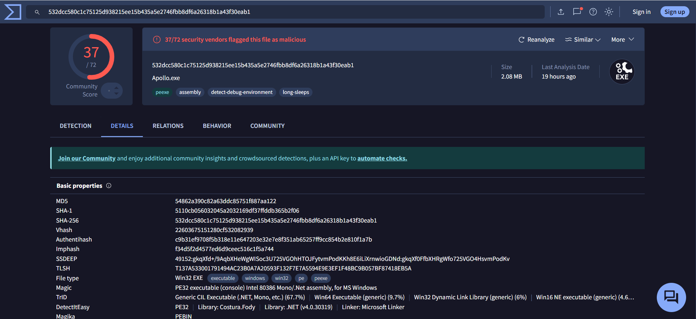

## 6.6. Analysis of the Malicious File in the VirusTotal Sandbox

To complement the analysis of artifacts related to the **Apollo agent**, a **dynamic test of the malicious file was performed using VirusTotal**.  
This service allows **uploading suspicious samples to an isolated sandbox environment**, and then **presents the collected results from multiple antivirus engines and analytical tools**.

For this test, the **`update_service_Mal.exe` executable file** (previously identified as a **C2 agent component**) was uploaded for dynamic analysis.  
**Already during the AV engine scan, 37 out of 72 engines flagged the file as malicious** (Figure 30).  
They classified it as **trojan/apollo**, clearly linking the sample to a **malware family specialized in C2 communication**.

**Figure 30 — Apollo.exe detected by 37/72 AV engines**

In the **“Details” tab**, multiple **technical properties of the file** were retrieved (Figure 31):

- **File size:** 2.08 MB  
- **File type:** Win32 EXE  
- **OriginalFileName:** Apollo.exe  
- **Embedded libraries:** Costura.Fody  
- **Hashes:**  
  - **SHA-256:** `532dcc580c1c75125d938215ee15b435a5e2746fbb8df6a26318b1a43f30eab1`  
  - **MD5:** `54862a390c82a63ddc85751f887aa122`

**Figure 31 — Apollo.exe file properties – details view**

Interestingly, **before uploading the file to the sandbox**, an attempt to **identify its reputation using only its SHA-256 hash** returned **no results** (Figure 32).  
The file **had never been seen before by any AV engines**, despite having a valid hash.  

This was because the file was **generated exclusively for the laboratory environment** and had **never been used in real-world malware campaigns nor published publicly**.  
Therefore, the **VirusTotal reputation database contained no information about this specific file**.

**Figure 32 — No reputation results when searching by hash before sandbox upload**

This result highlights an **important limitation of using only file hashes for threat analysis** — if a malicious file has **never been seen in public databases**, its hash **cannot indicate its threat level**.  
The same applies to **IP addresses or domains**. In this case, the **C2 server IP (192.168.2.10)** was **not submitted to VirusTotal**, as it was a **private lab address** not present in public threat intelligence databases.

The situation changed **after the file was uploaded to the sandbox**.  
Once the **dynamic analysis completed**, the file was **classified as potentially malicious**, and **VirusTotal updated its database with the hash**.  
Every subsequent search for the same hash **returned a full report**.

This confirms that **VirusTotal not only analyzes the sample but also permanently records its metadata and artifacts**.  
This means that **simply uploading a sample enriches global reputation databases**, which can **support other analysts and automated detection systems**.  
Even if the **original file is later deleted**, it can still be **identified by its hash recorded during the sandbox analysis**.

Additionally, **VirusTotal provides detailed information** such as:

- file write paths and child processes  
- contacted IPs and domains  
- anti-analysis techniques used  
- similarity to other samples  
- digital signature details  
- first-seen timestamps

These details can greatly help with **further threat identification and correlation**.

In this study, **VirusTotal conclusively confirmed the malicious nature of `Apollo.exe`**.  
**Sandbox analysis played a key role** in verifying the threat, especially since **the file had no prior reputation**.  
This case shows that **having only a hash is not always enough** — sometimes it is essential to perform **dynamic analysis to observe the file’s behavior in a controlled environment**, which can also **result in it being recognized by other security systems in the future**.
