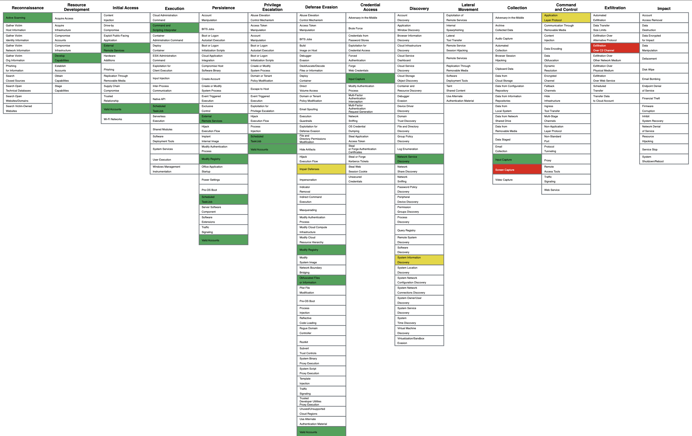

## 7.3. Mapping the Scenario to the MITRE ATT&CK Framework

To better understand the **techniques and tactics used by the attacker**, the entire scenario was mapped to the structure of the **MITRE ATT&CK** framework — a well-known knowledge base describing adversary behavior in real-world security incidents.  
This framework is divided into **tactics** (representing adversary goals) and **techniques** (describing how those goals are achieved).

The mapping process was **not automatic** — it required **conscious analysis and manual selection**.  
Because ATT&CK contains a **very large number of techniques**, the key was to **narrow down the context**:  
for each attack step, the **intended goal** was identified (e.g., execute code, gain persistence, hide activity, collect data),  
then the **corresponding tactic** was selected (e.g., Execution, Persistence, Collection), and finally the **most accurate technique within that tactic** was chosen.

Each potential technique was then **verified in the MITRE ATT&CK knowledge base**, ensuring that it **matched the actual actions observed in logs and in the environment**.  
This approach allowed for **precise and accurate mapping** of specific attack fragments to ATT&CK techniques.  

Although this process involved **interpretative decisions rather than exact matching**, this **flexibility is a strength of the framework**, making it valuable for SOC analysts.  
It also exemplified **structured and deliberate organization of analytical work**, which improved the **clarity, accuracy, and efficiency** of the entire investigation.

---

### Techniques mapped to the attack scenario

- **Reconnaissance**  
  - `Active Scanning (T1595)` – active scanning with **Nmap** to identify hosts, open services (RDP on port 3389), and operating systems.

- **Resource Development**  
  - `Develop Capabilities: Malware (T1587.001)` – creating a custom malicious `.exe` payload using **Mythic C2**.

- **Initial Access**  
  - `Valid Accounts (T1078)` – credentials obtained through **brute-force**  
  - `External Remote Services (T1133)` – logging in remotely through **RDP**

- **Execution**  
  - `Command and Scripting Interpreter: PowerShell (T1059.001)` – running **Base64-encoded PowerShell commands**  
  - `Windows Command Shell (T1059.003)` – using `cmd.exe`  
  - `Scheduled Task/Job (T1053)` – running a **scheduled task** as part of persistence

- **Persistence**  
  - `Scheduled Task/Job (T1053)` – scheduled task with SYSTEM privileges  
  - `Registry Run Keys / Startup Folder (T1547.001)` – registry entry to run the payload at startup

- **Defense Evasion**  
  - `Obfuscated Files or Information (T1027)` – **Base64-encoded commands**  
  - `Disable or Modify Tools (T1562.001)` – modifying **Windows Defender** settings using `Add-MpPreference`

- **Credential Access**  
  - `Input Capture (T1056)` – **keylogger injected into `notepad.exe`**

- **Discovery**  
  - `System Information Discovery (T1082)` – commands: `whoami`, `systeminfo`, `ipconfig`  
  - `Network Service Discovery (T1046)` – using **Nmap** to find active hosts and open ports

- **Collection**  
  - `Screen Capture (T1113)` – capturing screenshots using the `screenshot` command

- **Command and Control**  
  - `Application Layer Protocol: Web Protocols (T1071.001)` – **Apollo agent communicating via HTTP** with the C2 server

- **Exfiltration**  
  - `Exfiltration Over C2 Channel (T1041)` – exfiltrating data through the same C2 channel

---

All these techniques were **marked and mapped in the MITRE ATT&CK Navigator** (Figure 33),  
which provided a **visual overview of the scope and complexity of the attack**.

- **Green** – technique was **clearly detected and documented in logs**  
- **Yellow** – technique was **only partially detected**  
- **Red** – technique **occurred but was not detected**

**Figure 33 — Mapping of the attack scenario to MITRE ATT&CK in the Navigator tool**

---

This type of mapping brings several **practical benefits**:

- Provides a **clear visual representation of the entire attack**, making it easier to see which areas were compromised and which were untouched
- Each marked technique links to **detailed technical documentation** in the MITRE ATT&CK knowledge base
- Helps **learn about variants, APT groups using the technique, and recommended detection/mitigation methods**
- Supports **post-incident analysis**, but is also a **valuable educational and design tool** for:
  - creating security policies  
  - building detection scenarios  
  - and **training SOC teams**
